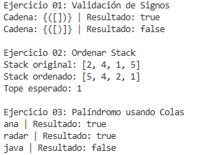
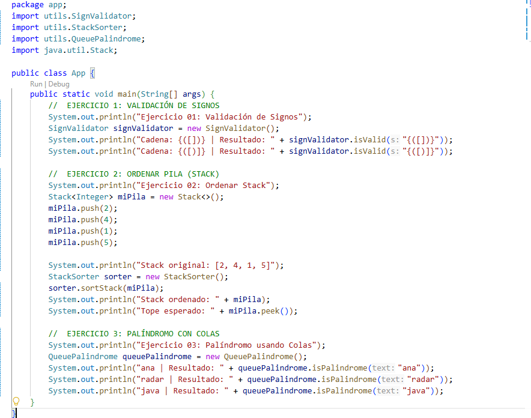

# Práctica: Estructuras Dinámicas Lineales

## Datos del Estudiante
- **Nombre:** Nicole Dominguez
- **Curso:** Estructura de datos grupo # 3 
- **Fecha:** 10/06/2026

---

## Descripción general del proyecto
El presente proyecto tiene como objetivo la implementación y validación de estructuras de datos lineales (Pilas y Colas) en Java. Se han desarrollado tres módulos principales para resolver problemas clásicos de gestión de información mediante el uso de estas estructuras dinámicas.

## Ejercicios implementados

### Ejercicio 01: SignValidator
**Descripción:** Este ejercicio utiliza una pila para validar que los símbolos de apertura (`(`, `{`, `[`) coincidan correctamente con sus respectivos cierres. La pila permite verificar el orden LIFO (Last-In, First-Out), asegurando que el último símbolo abierto sea el primero en cerrarse.

### Ejercicio 02: StackSorter
**Descripción:** Implementa un algoritmo para ordenar una pila de números de forma ascendente. Para lograrlo, se emplea una pila auxiliar, lo que permite reubicar los elementos de manera ordenada sin utilizar estructuras de datos adicionales, manteniendo la restricción de gestión de memoria lineal.

### Ejercicio 03: QueuePalindrome
**Descripción:** Determina si una palabra o cadena es un palíndromo (se lee igual al derecho que al revés). La lógica emplea una cola para almacenar el orden original y se compara con la lectura invertida, validando así la simetría de la cadena de entrada.

---

## Evidencias de ejecución

### Captura del código de implementación

## Conclusiones

1. **Sobre las Pilas:** Me di cuenta de que las pilas son súper útiles para validar signos, porque como funcionan al revés (lo último que entra es lo primero que sale), te permiten ver fácilmente si los paréntesis o corchetes están bien cerrados.

2. **Sobre las Colas:** Usar colas me ayudó a entender mejor cómo mantener el orden de los datos. Para los palíndromos, fue clave ver cómo al comparar el orden original con el invertido se puede confirmar si una palabra es igual de ambos lados.

3. **Sobre el Ordenamiento:** El ejercicio de ordenar la pila me costó un poco más, pero me sirvió para ver cómo resolver un problema usando solo otra pila auxiliar. Al final, logré organizar todo sin necesidad de usar estructuras más complicadas.

---

## Control de versiones
- **URL del Release:** [Insertar enlace aquí]